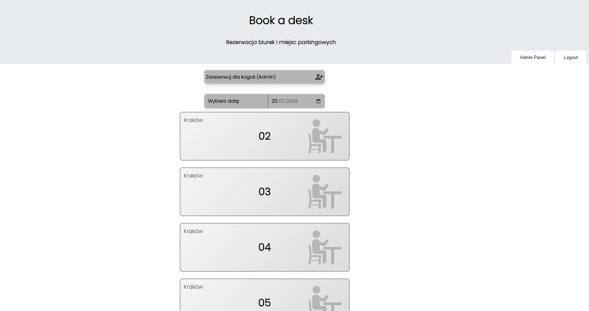

<h1>Desk and Parking Reservation App</h1>
The Desk and Parking Reservation App revolutionizes how individuals reserve workspace and parking areas within their workplace. Designed to address the common challenges of booking desks and parking spots, this application offers an efficient and user-friendly solution that enhances workplace management and employee satisfaction. With features tailored to both users and administrators, the app ensures a seamless reservation process, fostering a more organized and accessible work environment.

<h3>Key Features</h3>
<b>Intuitive Booking System</b: Users can effortlessly reserve their preferred desk spaces and parking spots through a simple and intuitive interface, making the process quick and hassle-free.

<b>QR Code Reservations</b: Enhancing convenience, the app supports desk reservations through QR codes. Users can simply scan a QR code to book spaces, ideal for on-the-go reservations without the need to access the app directly.

<b>Administrator Panel</b: A comprehensive administrator panel allows for the efficient management of bookings, users, and available resources. This feature provides administrators with the tools needed to oversee workspace allocations and adjustments smoothly.

<b>User-Friendly Interface</b: Designed with user experience in mind, the application boasts a clean and straightforward interface, ensuring that users of all technical levels can navigate and make reservations without difficulties.

<h3>Technology Stack</h3>
<b>Initial Design in Node.js</b>: The application was initially developed using Node.js, leveraging its asynchronous event-driven JavaScript runtime to build scalable network applications.

<b>Rewritten in PHP</b>: Due to deployment limitations and the need for a more streamlined server-side solution, the application was subsequently rewritten in PHP. This transition allowed for greater flexibility and compatibility with various hosting environments, ensuring a robust and reliable performance.
